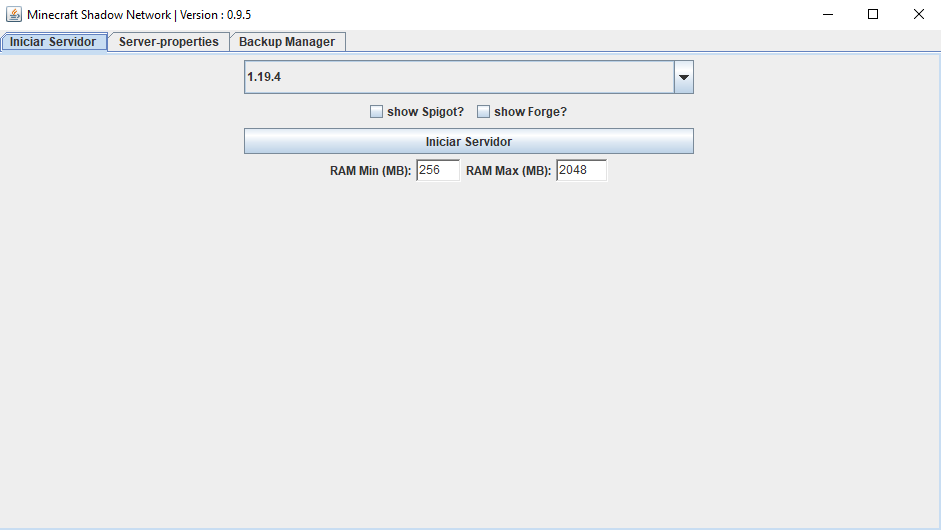
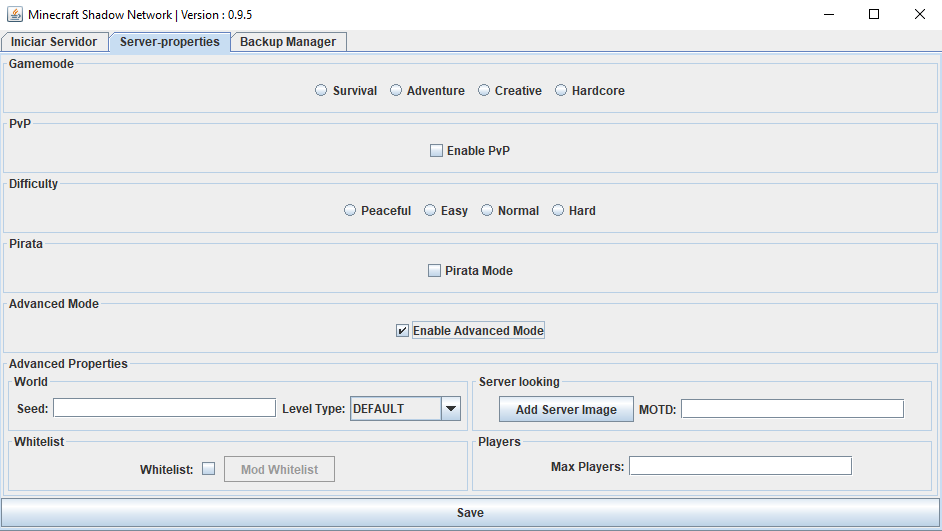
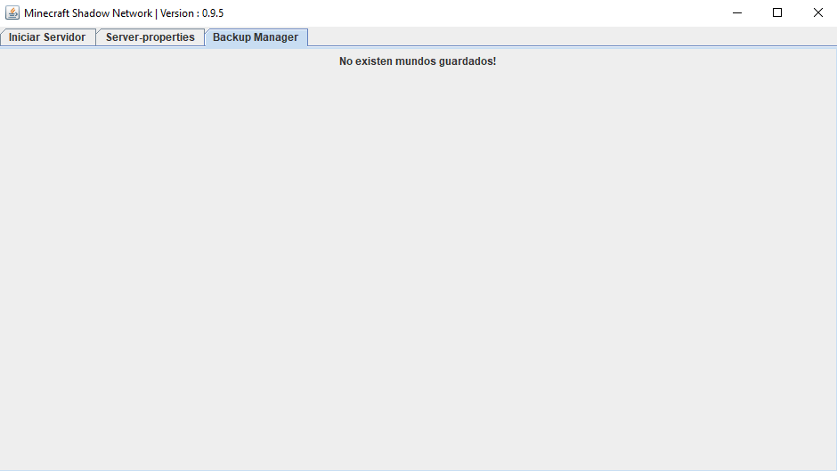
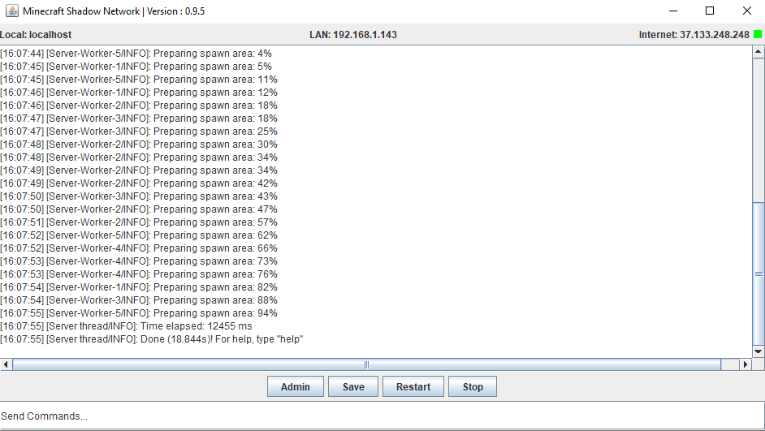

# Proyecto de Gestión Automática de Servidores de Minecraft


Este proyecto tiene como objetivo proporcionar la solución definitiva más fácil y automatizada para la gestión de servidores de Minecraft, especialmente dirigida a usuarios menos expertos. Con esta herramienta, los usuarios podrán crear servidores de forma automática en cualquier versión de Minecraft, modificar la configuración del archivo `server.properties` de manera intuitiva, realizar backups automáticos y acceder a un panel especial para una administración avanzada.

## Características

1. **Creación automática de servidores**: Nuestro proyecto permite a los usuarios crear servidores de Minecraft de forma automática en cualquier versión deseada. El proceso de configuración y puesta en marcha se simplifica al máximo, permitiendo que incluso los usuarios menos expertos puedan tener su servidor en funcionamiento rápidamente.

2. **Modificación intuitiva de `server.properties`**: Para facilitar la personalización de los servidores, hemos desarrollado una interfaz intuitiva que permite a los usuarios modificar el archivo `server.properties` de manera sencilla. Los usuarios podrán ajustar parámetros como el tamaño del mundo, la dificultad, las reglas del juego, entre otros, sin necesidad de editar directamente el archivo de configuración.

3. **Backups automáticos**: La pérdida de datos es un problema común en los servidores de Minecraft. Para evitarlo, nuestro proyecto implementa un sistema de backups automáticos que realizará hasta 15 copias de seguridad periódicas cada vez que el servidor sea cerrado. Los usuarios podrán recuperar mediante un gestor de backups sus mundos, asegurando la protección de sus datos.

4. **Panel de administración avanzado**: Nuestra herramienta proporciona un panel especializado para la administración avanzada del servidor. A través de esta interfaz, los usuarios podrán realizar tareas como el monitoreo en tiempo real, la administración del servidor, Schedules de comandos o reinicios, y guardar de forma rapida el LOG. El panel de administración ofrece una experiencia intuitiva y amigable para simplificar las tareas de gestión.

5. **Puertos Automaticos**: Permite a los usuarios abrir de forma automatica los puertos, evitando asi que los usuarios con menos conocimientos se queden estancados a la hora de abrir su propio servidor. Aun asi, no es totalmente definitivo y puede fallar si el router no admite este tipo de interacción, para aquellos usuarios y para los más avanzados, siempre se podrá abrir de forma manual.

## Capturas de pantalla

A continuación, se presentan algunas capturas de pantalla que muestran la interfaz y las funcionalidades del proyecto:

1. **Creación automática de servidores**:



2. **Modificación intuitiva de `server.properties`**:



3. **Backups automáticos**:



4. **Panel de administración avanzado**:



## Requisitos y Configuración

Para utilizar este proyecto, se requiere tener instalado lo siguiente:

- Java Runtime Environment (JRE) versión 1.8 o superior.   [[Descargar Java](https://www.java.com/es/download/ie_manual.jsp)]

Para configurar el proyecto, siga los siguientes pasos:

1. Clona el repositorio desde GitHub:

```
git clone https://github.com/Andres95123/Minecraft-Shadow-Network
```

2. Inicia la aplicación:

· Utilizando doble click en el .jar o mediante el siguiente comando en el mismo directorio de trabajo

```
java -jar ShadowNetwork.jar
```

## Actualizaciones

El proyecto se irá actualizando con el tiempo. Si deseas saber si existe una nueva versión, simplemente inicia la app. Automaticamente te indicará si existe una nueva actualización y si deseas instalarla automaticamente.

## Contribución

Este proyecto actualmente esta en desarollo y es un proyecto personal, con el objetivo de aprender a utilizar de forma más completa el lenguaje de programación JAVA ORACLE.

## Licencia
[](https://creativecommons.org/licenses/by-nc-sa/4.0/)

[Ver el archivo de licencia](License.md)

#

¡Esperamos que disfrutes utilizando nuestro proyecto para gestionar tus servidores de Minecraft de forma automática y sencilla!

#